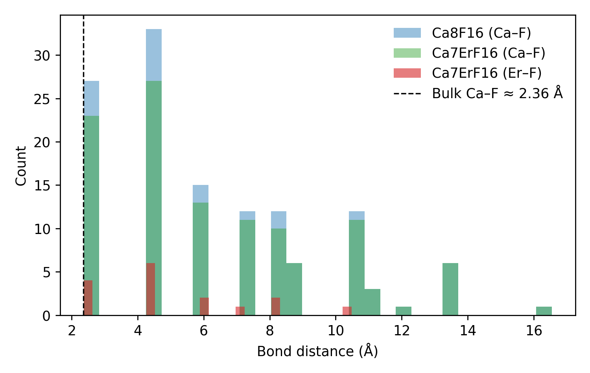

# CaF₂ vs Er–Doped Cluster Bond Analysis

| System | Mean Ca–F (Å) | Mean Er–F (Å) | Δr (Å) |
|:--------|:---------------:|:---------------:|:-------:|
| Ca8F16 | 6.308 | — | — |
| Ca7ErF16 | 6.475 | 5.141 | -1.334 |

