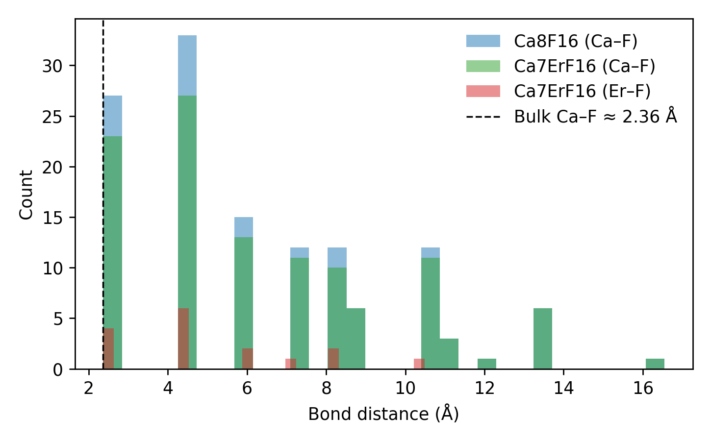

# CaF₂ vs Er–Doped Cluster Bond Analysis

## Ca8F16
- **File:** caf2_cluster.xyz
- **Elements:** {'Ca': 8, 'F': 16}

### Ca–F Distance Statistics (Å)
- Count: 128.000
- Min: 2.364
- Mean: 6.308
- Median: 5.950
- Max: 16.550
- Std: 3.256

---
## Ca7ErF16
- **File:** caf2_er_cluster.xyz
- **Elements:** {'Ca': 7, 'F': 16, 'Er': 1}

### Ca–F Distance Statistics (Å)
- Count: 112.000
- Min: 2.364
- Mean: 6.475
- Median: 5.950
- Max: 16.550
- Std: 3.339

### Er–F Distance Statistics (Å)
- Count: 16.000
- Min: 2.364
- Mean: 5.141
- Median: 4.527
- Max: 10.485
- Std: 2.366

---

